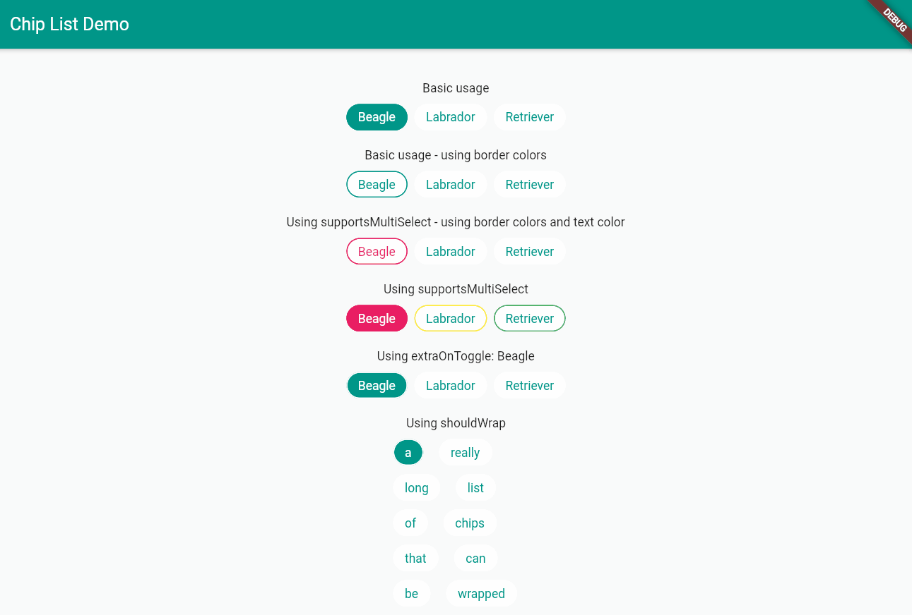

## Features

Creates a list of `ChoiceChips`. Also allows for selecting multiple chips at once and exposes all values to use in case you wish to use the widget in sync with others.

See `/example/main.dart` for an example on how to use the state of the list for updating the state of other widgets.

## Getting started

Import it !

```dart
import 'package:chip_list/chip_list.dart';
```

## Usage

Check out the `/example` folder for a minimal working demo of the package in action.




But, briefly:

```dart
ChipList(
    listOfChipNames: _theListOfStringsYouWishToDisplay,
    activeBgColor: _anActiveBackgroundColor,
    inactiveBgColor: _anInactiveBackgroundColor,
    activeTextColor:_anAactiveTextColor,
    inactiveTextColor: _anInactiveTextColor,
    listOfChipIndicesCurrentlySeclected: [index/indices depending on the use case],
),
```

## Additional information

Found an issue ? [Please let me know !](https://github.com/bossbeagle1509/chip_list/issues)

Upcoming features:

1. Transition animations
2. Per item text and background colorization
